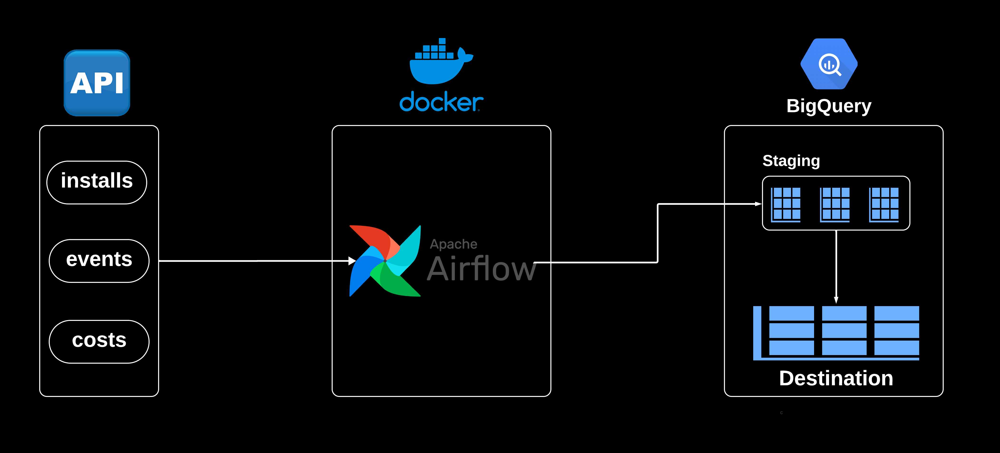
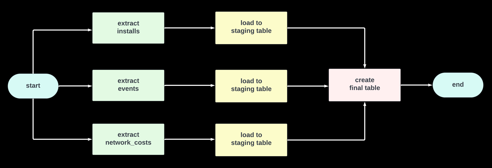
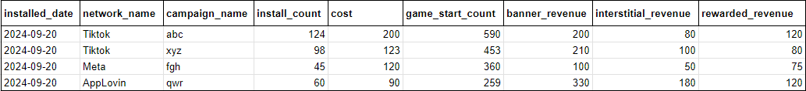

# API-BIGQUERY ELT ORCHESTRATION
 

## Description
- A daily pipeline that extracts data from 3 endpoints and save final results to BigQuery table.
- Swagger API is used to extract data.

## DAG


## SCHEMAS

### 1. Installs  
```bash
[
  {
    "user_id": "c21b5943-ed04-4db4-a184-b873ee28ba54",
    "installed_at": "2024-09-20 22:19:37.763791",
    "network_name": "Mintegral",
    "campaign_name": "Campaign_2"
  },
  {
    "user_id": "91c93e89-67f5-4ba1-adbd-63c63aaaa00f",
    "installed_at": "2024-09-20 13:40:02.243143",
    "network_name": "ACME Installs",
    "campaign_name": "Campaign_1"
  },
  {
    "user_id": "e5ad59c1-7ce8-4b5e-987d-b1d419963aac",
    "installed_at": "2024-09-20 03:38:51.162068",
    "network_name": "Vungle",
    "campaign_name": "Campaign_3"
  }
]
```

### 2. Events
```bash
[
  {
    "user_id": "d4cb86c3-34d8-452d-9045-076f3dafb8f1",
    "event_ts": "2024-09-20 22:40:13.283068",
    "event_name": "LevelEnd"
  },
  {
    "user_id": "0217e45b-2378-4396-b32b-b73f263188d6",
    "event_ts": "2024-09-20 11:54:15.236004",
    "event_name": "TicketSpent"
  },
  {
    "user_id": "1a98f522-12da-4e55-9221-d5498fed36c1",
    "event_ts": "2024-09-20 02:16:15.379805",
    "event_name": "GameStart"
  }
]
```

### 3. Network Costs 
```bash
[
  {
    "date": "2024-09-20 00:00:00",
    "network_name": "Tiktok",
    "campaign_name": "Campaign_2",
    "creative_name": "concern_congress_benefit_set.",
    "cost": 21.312275769429267
  },
  {
    "date": "2024-09-20 00:00:00",
    "network_name": "Unity",
    "campaign_name": "Campaign_1",
    "creative_name": "career_throw_measure_receive.",
    "cost": 19.951249117430212
  },
  {
    "date": "2024-09-20 00:00:00",
    "network_name": "ACME Installs",
    "campaign_name": "Campaign_2",
    "creative_name": "cause_yourself.",
    "cost": 44.74388269115063
  }
]
```
### 4. Final Table



## Prerequisites
A GCP Project with followings; 
- A BigQuery Dataset
- A service account with BigQuery Admin Role
- Key file for service account


## Windows Local Installation with Docker-Compose 

### 1. Start Docker Desktop application. 
If you don't have Docker Desktop click [here](https://docs.docker.com/desktop/install/windows-install/) to install.


### 2. Clone this repository, use the following command:
```bash
git clone https://github.com/tmuratcamli/Airflow-Api-BigQuery.git
````

### 3. Update first path of this line in docker-compose file by replacing with path you store GCP key. 
```bash
absolute/path/to/your/gcp/key:/opt/airflow/gcp_key.json
````

### 4. Change .envexample extension as .env and update variables, followings are essential. 
```bash
PROJECT_ID = "your_gcp_project_id"
DATASET_ID = "your_dataset_id"
````

### 5. Initialize Airflow inside docker container.
```bash
docker-compose -f docker-compose-dev.yaml up airflow-init
````

### 6. Start Airflow components such as webserver, scheduler, worker, triggerer. 
```bash
docker-compose -f docker-compose-dev.yaml up -d
```

### 7. To see Airflow UI on your [localhost.](http://localhost:8080) Sign in with password and user in .env file.
 ```bash
_AIRFLOW_WWW_USER_USERNAME='your_web_ui_username'
_AIRFLOW_WWW_USER_PASSWORD='your_web_ui_password'
```

## NOTES
 - It is used pre-built docker image for Airflow 2.9.1 version. 
 - To check apache/airflow:2.9.1 in Docker Hub [click here.](https://hub.docker.com/layers/apache/airflow/2.9.1/images/sha256-4b494609394706cc866431cfed10701c38c383c97e435cb2462a77acc70bb150)
 - Project can be adapted to other use cases by modifying URL's and query.
 - Consider to use intermediary storage for the high volume data cases. 
